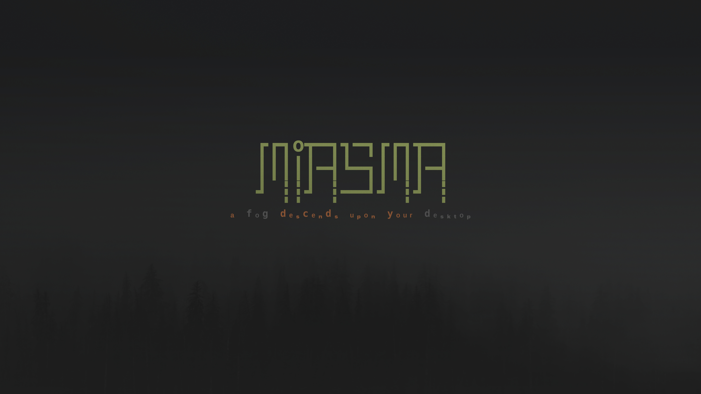
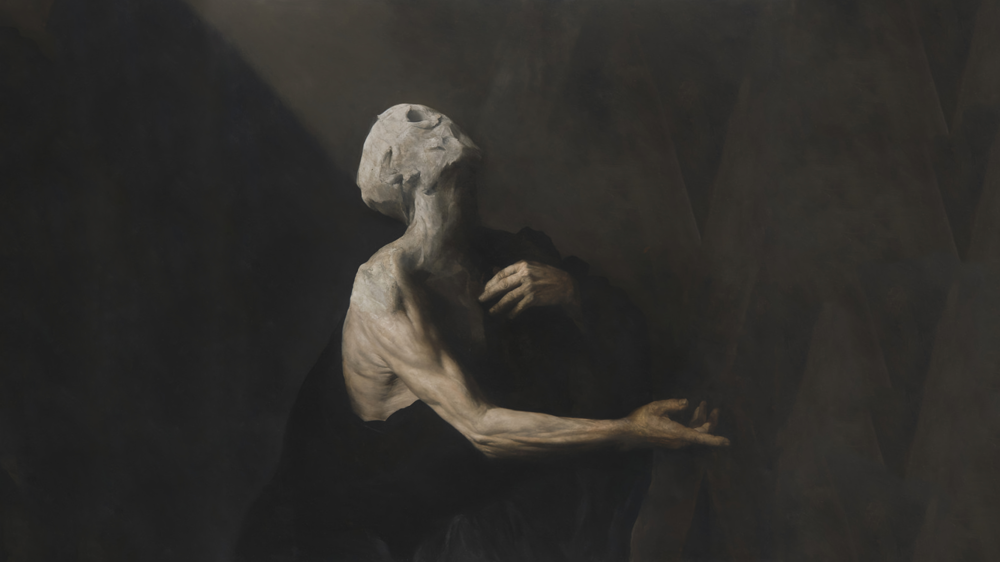
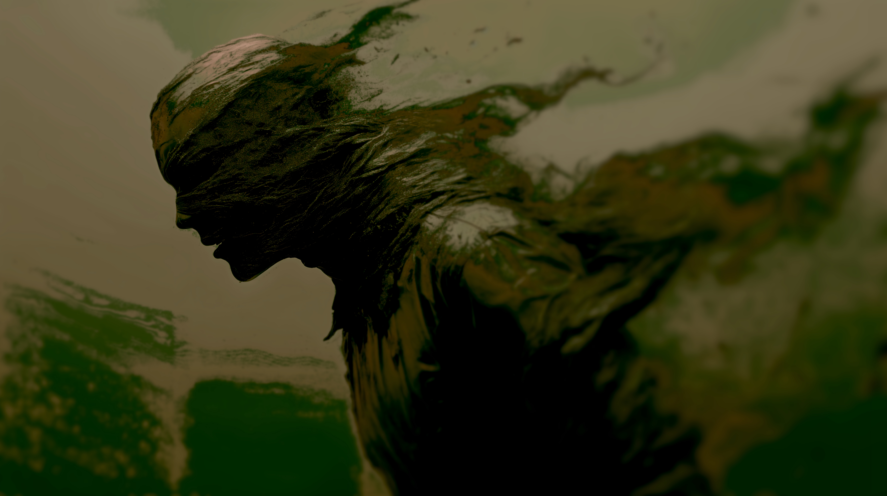
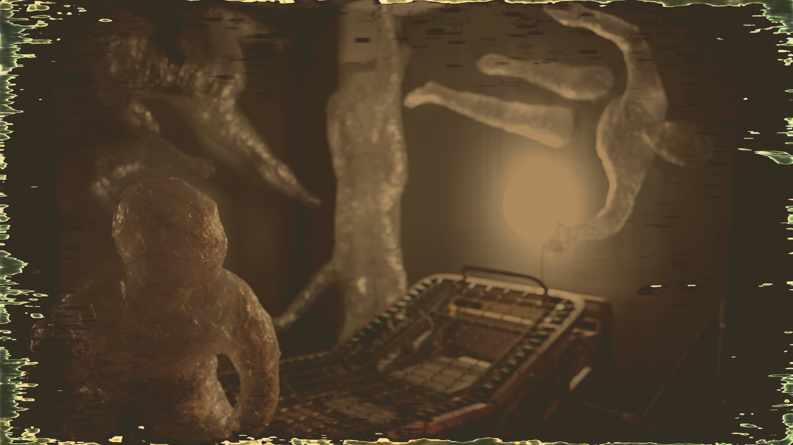
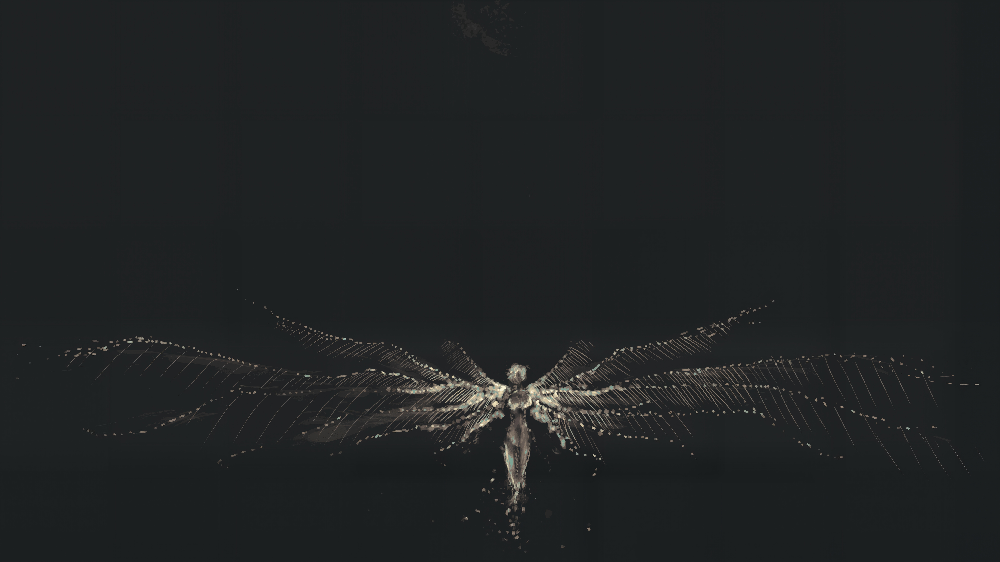
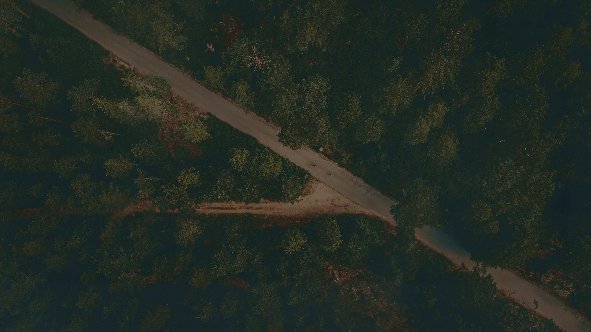
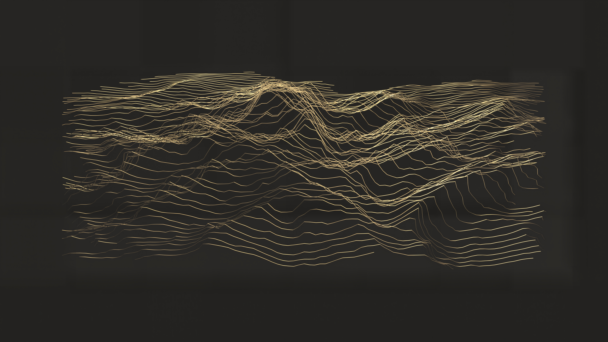
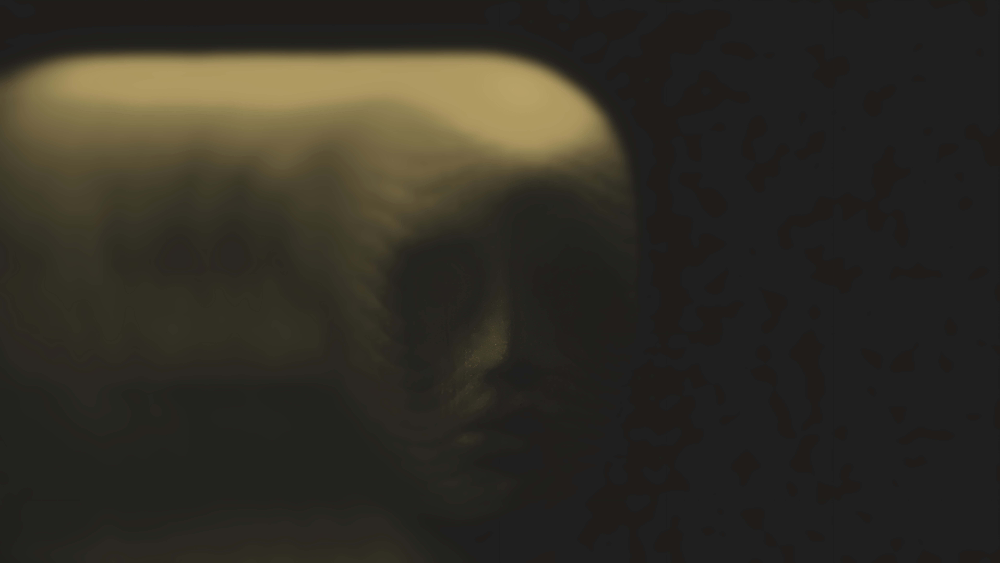

# Omarchy Miasma Theme

A dark, organic Omarchy theme built around xero's canonical Miasma palette: cellar-black surfaces, pale linen text, mossy greens, rust, clay, and sickly gold.


## Install

```bash
omarchy theme install https://github.com/OldJobobo/omarchy-miasma-theme
```

## Omarchy Quattro support

Miasma includes a native Omarchy 4/Quattro path:

- `colors.toml` keeps the canonical Miasma ANSI palette while providing semantic Quattro roles.
- `shell.toml` themes the bar, controls, popups, notifications, launcher, menus, Polkit prompt, lock prompt, and image picker.
- `hyprland.lua` provides coordinated active/inactive gradients, blur, shadow, and Miasma animations.
- Quattro outputs cover Foot, Helix, Pi, Obsidian, VS Code, Gum, RGB keyboards, and the screen-share picker.
- `preview-unlock.png` and `unlock.png` provide the theme-picker and unlock presentation assets.

The committed terminal files are intentional: they preserve Miasma's exact ANSI white and bright-black slots where Omarchy's semantic aliases favor UI text roles.

## Legacy compatibility

The theme retains coherent Omarchy 3.8-era surfaces for users who still load them:

- `hyprland.conf` and `hyprlock.conf`
- `waybar.css` and the optional `waybar-theme/` variant
- `walker.css`, `mako.ini`, and `swayosd.css`
- `wofi.css`

## Additional integrations

- Terminals: Alacritty, Foot, Kitty, Ghostty, and Warp
- Editors and tools: Neovim, Helix, VS Code, Pi, btop, Fish, fzf, Gum, and cava
- Apps: GTK, Chromium, Firefox, Obsidian, Steam, and Vencord
- Aether overrides for supported Aether workflows

## Neovim

`neovim.lua` loads `OldJobobo/miasma.nvim`, the maintained Miasma plugin used by this theme, and selects the `miasma` colorscheme in LazyVim.

## Wallpapers

| | | |
| --- | --- | --- |
|  |  |  |
|  |  |  |
|  |  |  |

## Attribution

- Miasma palette and original Neovim theme by xero: <https://github.com/xero/miasma.nvim>
- Waybar variant adapted from HANCORE Linux's Waybar themes: <https://github.com/HANCORE-linux/waybar-themes>
